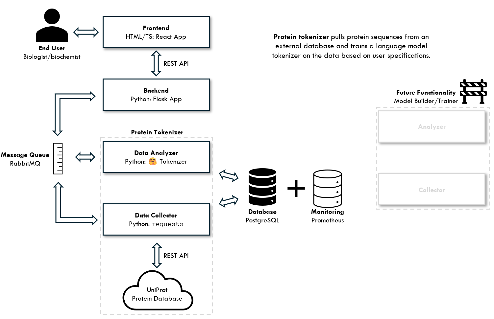

# protein tokenizer

A small web application developed as a requisite for a computer science course. Protein tokenizer fetches protein amino acid sequences from the [UniProtKB](https://www.uniprot.org) database and trains a byte pair encoding [tokenizer](https://huggingface.co/docs/tokenizers/en/index) on the results. It is a minimum viable product written soley to practice implementing a microservice architecture.

## installation

**requirements**

- make
- python
- virtualenv
- pip
- node

**setup**

`make install`

**tests**
For unit tests:
`make test/unit`

For integration tests:
`make test/integration`

Note that the frontend, datacollector, and dataanalyzer need to be running to perform the integration test.

## running

- first start rabbitmq, postgres, and prometheus

`docker compose up`

- run the services

`make run backend`

`make run datacollector`

`make run dataanalyzer`

`make run frontend`

- navigate to the frontend web address
- prometheus should be exposed at http://localhost:9090

## project info

This application is composed of four major components: a ReactJS frontend, a FastAPI backend, a data collector, and a data analyzer. The latter three services communicate with one another via AMQP (RabbitMQ). The frontend sends messages to the backend via a simple REST API and the backend responds aysnchronously through server-sent events. Persistent data in the form of search queries and search results are stored in a Postgres database. Endpoints are exposed for service monitoring, which is handled by Prometheus. Continuous integration and continous deployment are handled through Github Actions.

